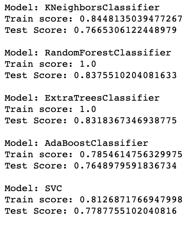
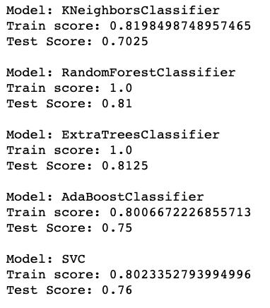
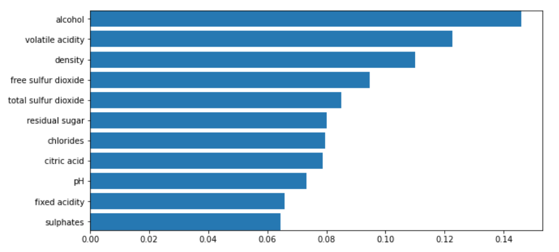
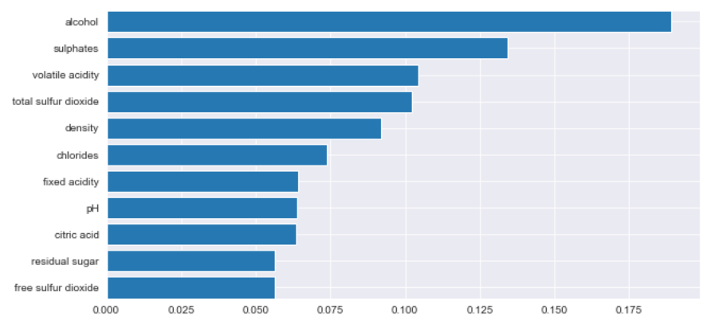

# Wine-Project:
 

  

## Project Information
In our project we created a model that would predict the quality of white and red wine creation using supervised and unsupervised machine learning.
This is an ideal tool for anyone interested in creating a custom wine, especially those interested in tapping into the wine industry. It's also perfect for buyers looking to see the quality of a potential wine purchase. 

Wine quality refers to the factors that go into producing a wine, as well as the indicators or characteristics that tell you if the wine is of high quality. The wine industry is investing in new technologies for both wine making and selling processes. Wine certification and quality assessment are key elements within this context. Quality evaluation is often part of the certification process and can be used to improve wine making (by identifying the most influential factors) and to stratify wines such as premium brands (useful for setting prices). When you know what influences and signifies wine quality, you’ll be in a better position to make good purchases.

In our models we analyzed the effects of selected features based on physicochemical (input) variables by using Random Forest Classifier. We built two models: for red wine and white wine to predict the quality score of the wine (output variable). The model assumes that for the good quality wine (as a Good Choice from our model) the score is 6 and higher (from scale 1 to 10). We also used KMeans model, with PCA on the red wine dataset and visualized the clusters.
In addition, as a bonus, we built an additional model for prediction of the quality based on the wine price, variety and country of origin. Our prediction comes with   % accuracy.

We decided to use Tableau for further exploration of those datasets. All twelve variables in two datasets were considered for correlation analysis and visualization to identify features which correlate the most with the quality. 

Then, we utilized HTML with bootstrap and CSS styling and flask capabilities to deploy a website onto Heroku

## Table of Contents
* [Heroku Website Deployment](#heroku-website-deployment)
* [Data Sources](#data-sources)
* [Coding files](#coding-files)  
* [Tableau Visualizations](#tableau-visualizations) 
* [Machine Learning](#machine-learning) 
* [Team Members](#team-members)

## Heroku Website Deployment

https://wine-quality-testing.herokuapp.com/index.html

## Data Sources 
* We leveraged data from two datasets, related to red and white variants of the "Vinho Verde" wine, from the north of Portugal. https://archive.ics.uci.edu/ml/datasets/Wine+Quality (winequality-red.csv, winequality-white.csv) (P. Cortez, A. Cerdeira, F. Almeida, T. Matos and J. Reis.) In our datasets, there is 1599 observations for the red wine and 4898 for the white wine. In each dataset there are 12 variables:
  * Volatile Acidity: the amount of acetic acids in wine, which at too high of levels can lead to an unpleasant, vinegar taste Higher levels indicating wine spoilage.
  * Total Sulfur Dioxide (SO2): is the amount of free & bound forms of SO2. Legal limit in US is 350 mg/l. SO2 is required to make high-quality wines that can stand the test of time. Sweeter wines usally get a little bit more for extra protection.
  * Free Sulfur Dioxide (SO2): it prevents microbial growth and the oxidation of wine. SO2 that is present in wine but has not yet reacted is considered “free.” Free SO2 content is usually around 25 mg/L at bottling time for the whites and 30 mg/L for the reds. 
  * Density: sweeter wines have a higher density.The density of wine is primarily determined by the concentration of alcohol, sugar, glycerol, and other dissolved solids.
  * Sulphates: they are there by natural processes, type of mineral salt.
  * Citric Acid: acts as a preservative to increase acidity (small quantities add freshness and flavor to wines)
  * Fixed acidity: are non-volatile acids that do not evaporate readily 
  * pH: describes how acidic or basic a wine is on a scale from 0 (very acidic) to 14 (very basic)
  * Residual sugar: is the amount of sugar remaining after fermentation stops. The key is to have a perfect balance between — sweetness and sourness (wines > 45g/l are sweet)
  * Alcohol: the percent alcohol content of the wine
  * Chlorides: the amount of salt in the wine
  * Quality: the sensory data, median
* Bonus: https://www.kaggle.com/christopheiv/winemagdata130k Use selected variables from this data set (price, region, country...), to build the machine learning model to be able to predict quality of wine.

## Coding Files
* Jupyter notebooks
    * ETL Process - Data from both datasets were loaded into jupyter notebook and ETL process was performed to identify possible missing values and inconsistencies in our data
    * Machine Learning (unsupervised) - Matplotlib, Numpy, Sklearn, hvplot, plotly
    * Machine Learning (supervised) - Seaborn, Sklearn, Numpy, Matplotlib, Joblib
* HTML / CSS

## Tableau Visualizations

### White Wine Visualizations and Analysis

 
The dashboard below describes box and whisker charts we used to compare each physiochemical percentage against the quality of wine. The quality ranged from 1-9 ( 9 being the best quality rating), and looked at the amount of a specific type a chemical in the quality rating.  The chemicals with the greatest amount of outliers were fixed acidity, chlorides, and citric acid.  This can tell that the lower the quality of wine, the greater amount of these particular chemicals we can find.

 

The scatter plots below measure each amount of a specific physiochemical in relation to the amount of alcohol based on the quality of the wine.  The greater the alcohol content is, the greater the chemical content appears to be.  For example, the greater the quality of wine is, the more alcohol and less sugar it has.

The bar graphs below show the content percentage of fixed acidity, sulphate, sugar, and alcohol ranging from high amounts to low amounts based on the quality.  The lower the quality of wine, the higher sugar and acid amounts.  This is an indication that the better quality of alcohol, the more expensive it is thus using more sulphates and less sugar.  More expensive wine is usually not very sweet and contains a very high alcohol percentage.

### Red Wine Visualizations and Analysis

The first Dashboard describes various parameters which defines quality of red wine. The quality of red wine is categorized as strong, medium and light on the basis of alcohol content and on various parameters responsible for cateegorizing red wine  as Strong, Medium and Light.

Second Dashboard describes the Quality of Red Wine on various chemical parameters and their correlation with quality.

-Parameters which have Less significance in defining quality of Red wine:- Fixed Acidity, Chlorides, Citric Acid, Density, PH, Volatile Acidity.

-Parameters which have More significance in defining quality of Red wine :- Alcohol percentage, Free sulfur Dioxide, Residual sugar,  sulphates, Total Sulfur Dioxide.

Third Dashboard is a pie representation of the dataset which defines that we have more strong wine quality data and less light quality data. When you hover over the graph on website, you can see the parameters and their content in various type of quality.

Final Dashboard is quality defining over alcohol percentage. Quality dependent on  other factors/parameters which are responsible for defining the quality of red wine as strong, medium and light. 

In tableau quality is defined as strong, medium and light which relates to good quality and bad quality in machine learning model.

I found out that some parameters which has lower significance in overall quality of red wine has high significance in defining strong quality like PH which has high significance in defining strong quality of red wine.

## Machine Learning
Our clean data from both datasets were used to build two separate models – for red wine and white wine to predict the quality of the wine. We decided to use LogisticRegression Model first to get an overview of our predictions. With an accuracy of about 74% from this model, we decided to build additional models. With all 11 variables as an input, these models performed as follows:

- White Wine Dataset:

- Red Wine Dataset:

The models did a good job in achieving decent accuracy scores. Based on our results we decided to use RandomForest Classifier, where the accuracy to predict the quality of the wine was 83% for the white wines dataset and 81% for the red wine dataset. For each model, we applied feature importance calculation to choose which of our data features are most helpful towards our goal – faster training, interpretability, and to help validate the relevant variables for our models. Then we selected the top N most important features using the selection mechanism (SelectFromModel).

### Feature importance for datasets:

- White wine:

 
 
-  Red Wine:
 
  

The selection method chose the most important features from our model, which we used in the next step to build a different model to predict the quality of wines. For the white wines, four features were selected: alcohol, volatile acidity, density, and free sulfur dioxide. For red wines, five features were selected: alcohol, sulphates, volatile acidity, total sulfur dioxide, and density. 
On our website, we accept the selected features as user input, and then the values are uploaded and run through the selected random forest classifier machine learning model. The quality prediction output of wines within the good quality range (6-10) receive the message, “Good Choice,” and wines in the poor quality range (1-5) receive the message, ”...there are better wines”.
  

### K-means Model
In our K-means model, we used the data about the red wine and tried to predict similar clusters based on 12 variables (fixed acidity, volatile acidity, citric acid, residual sugar chlorides, free sulfur dioxide, total sulfur dioxide, density, pH, sulphates, alcohol %, quality). We performed dimensionality reduction using the PCA method.This technique first standardized the data set.This standardization helps to minimze large differneces between the ranges from the initial variables.  Then calculated the explained variance ratio for both red and white wines. They are both less than 30%. The reduced data was used as an input for our K-means Model. The number of groups is represented by K. One of the most challenging tasks in this clustering algorithm is to choose the right values of K. We used the Elbow method to identify the right value for K. K -means clustering aims to converge on an optimal set of cluster centers - centroids. The results with clusters and centroids are shown in our K-means graph. 
The k-means graph shows clusters been created by associating every observation with the mean closest to it. The centroids marked by X become the new mean of each cluster.

 ### Bonus: World Wines Model

We wanted to tackle the data about world wines from Kaggle and try to build a model which could give the quality output based on the price of the wine, country of origin, and variety of the wine. Those are information the consumers are usually considering before they choose a wine to buy. So, what will be the quality of the wine, can we predict the good quality of the wine based on our model?

The dataset originally contains information on 129,971 wines. After the ETL process, we keep data about 84,881 wines, with selected columns for the country, price, and variety as input variables and points as an output variable. Points were in the range from 80 to 100, and there were transformed to binary classification, with 0 values for the range below 85.7 and 1 and good quality for the range from 85.7 to 100 (based on the distribution of the data). For the price information was necessary to use bins (the price range was from $4.00 - $3,300.00), as for the final input for the machine learning model. Data about 33 wine varieties from 7 countries are used for the model to predict the quality in the RandomForest Classifier Model, which works with 73% accuracy to predict the quality of the wine.
 

## Team Members
* Melissa Diep
* Shuchi Khandelwal
* Megan Butler
* Tinuola Adepoju
* Joshua Pohl
* Dasa Simo
